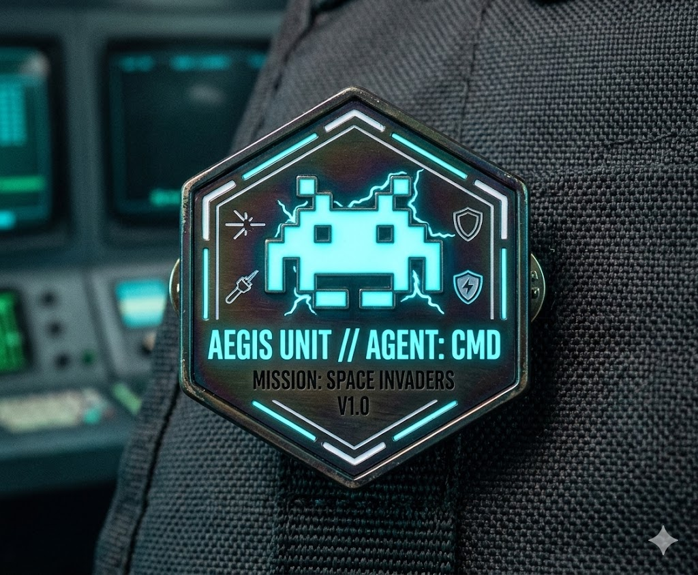

# 🛡️ AEGIS UNIT // MISSION: SPACE INVADERS V1.0

## 📋 Project Overview
**Agent:** CMD  
**Status:** Initializing Engine...  
**Objective:** Develop a modern, neon-infused space defense terminal with procedural waves and dynamic weapon upgrades.

---

## 🏗️ Infrastructure & Stack
This project is built to run on **Enterprise Private Cloud Infrastructure**:

* **Platform:** Red Hat OpenShift
* **Compute:** VMware vSphere Integrated Cluster
* **Runtime:** Node.js / Express
* **Database:** SQLite 3 (Persistence for Agent Leaderboards)
* **Storage:** 1Gi Persistent Volume (thin-csi)

### 🛰️ Deployment Strategy
Because we are utilizing **RWO (ReadWriteOnce)** storage on vSphere, the deployment is configured with a **Recreate** strategy. This ensures the volume lock is released correctly during rollouts.